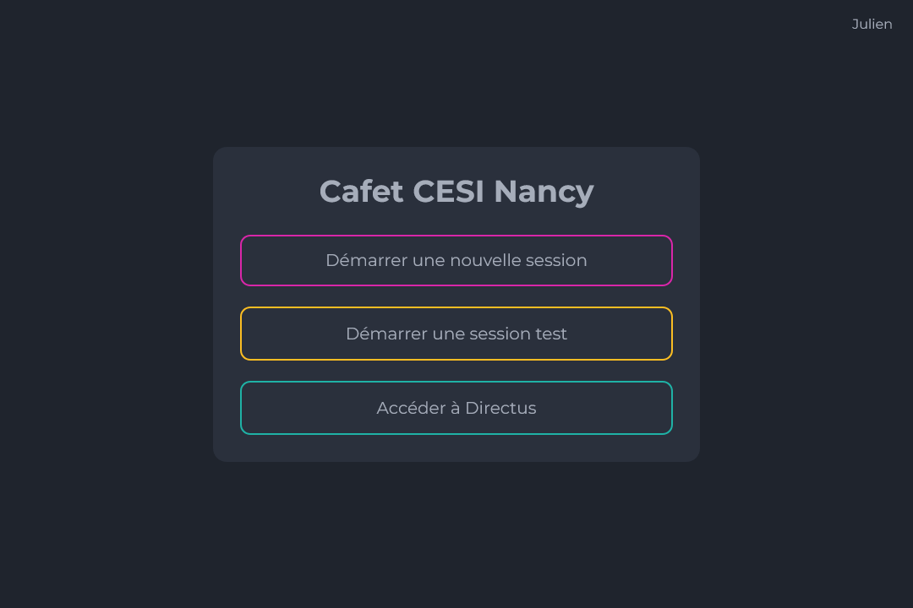
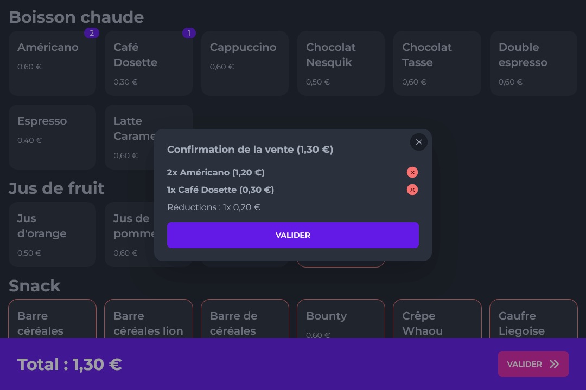
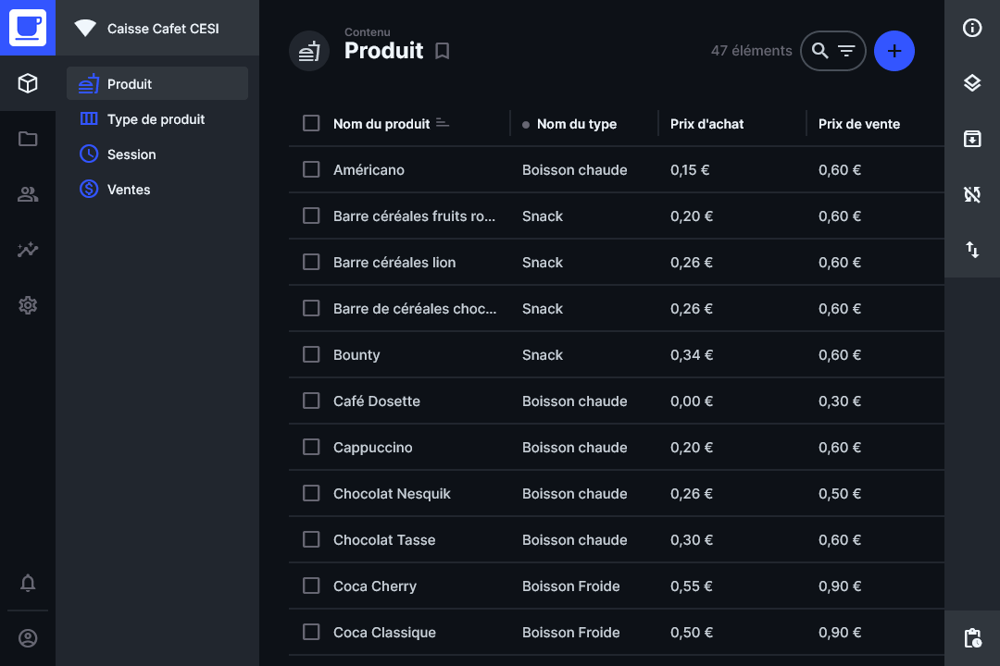
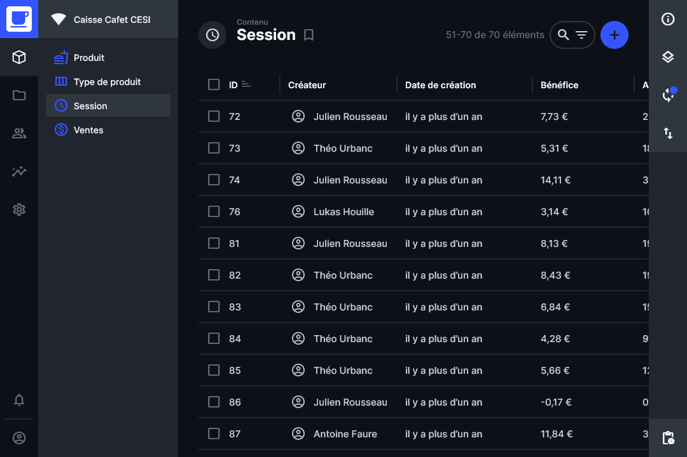

# Caisse Cafet CESI

## À propos du projet

Ce projet vise à créer un système de caisse en ligne pour la cafet.

Le CMS Directus est utilisé pour la gestion des produits, types de produits et ventes. Une interface web est créée avec
VueJS 3 et DaisyUI pour faire office de caisse enregistreuse, connectée au CMS.






## Développement

### Environnement

Docker et Docker Compose sont utilisés pour le développement et la mise en production. Pour démarrer le développement,
il faut lancer le script situé dans `scripts/compose-dev.sh`. Cela va lancer le `docker-compose.yml` avec l'overwrite de
développement `docker-compose.dev.yml`.

### Développement de l'interface web

Il est recommandé de ne pas lancer le container `web` pour le développement. Il a été désactivé, car impossible de faire
fonctionner le watcher des fichiers sources. Il faut donc lancer les deux commandes suivantes, la première afin de
lancer les bases de données et Directus, la seconde pour installer les dépendances web et le service de développement :

```bash
sh scripts/compose-dev.sh postgresql redis directus 
cd web && pnpm i --frozen-lockfile && pnpm dev
```

### Développement des extensions Directus

Un environnement de développement adapté aux extensions Directus a été créé. Pour cela, il faut que le container
`directus` soit lancé. Ensuite, similaire au développement de l'interface web, il faut lancer la commande suivante :

```bash
cd directus && pnpm i && pnpm watch
```

Cela va lancer le service de compilation des extensions Directus. Les fichiers sources des extensions doivent être 
placés dans un dossier suivant leur catégorie (`panels`, `displays`, `endpoints`), puis dans dossier avec leur nom. 
Le point d'entré de l'extension sera dans le fichier `index.ts`. Ainsi, un endpoint nommé `hello` sera placé dans
`directus/src/endpoints/hello/index.ts`. À noter que des types sont disponibles dans le fichier `src/types.d.ts` afin
d'aider au typage des extensions. Ce fichier est accessible avec l'alias `@types`.

**Remarque :** le watcher de compilation ne permet pas de créer ou de supprimer des extensions pendant qu'il est actif.
Si une de ces actions est effectuée pendant qu'il tourne, il devra être redémarré.

Pour mettre en production les extensions, elles seront compilées dans un Dockerfile, puis copiées dans une nouvelle
image nommée `cefadrom/cesi-cafet-directus`. Cette nouvelle image pourra aussi contenir les packages npm nécessaires
aux différentes extensions (hors packages déjà présents avec Directus).

## Production

### Déploiement

Pour lancer en mode production, créer le network `cafet_web` sur lequel sont disponibles le serveur web et Directus
aux adresses respectives `cafet-web:80` et `cafet-directus:8055`.

Les volumes `cafet_postgresql` et `cafet_directus_uploads` devront également être créés, afin de stocker respectivement
la base de données Postgres et les fichiers uploadés dans Directus.

Ensuite, afin de démarrer la mise en production, lancer la commande `docker-compose up -d --build`.

### Lien avec l'extérieur

Pour connecter le serveur web et le CMS à l'extérieur, il faut les lier à un reverse proxy qui va s'occuper de rediriger
les requêtes en fonction du domaine. Typiquement, on pourra utiliser Nginx, HaProxy ou encore Caddy (des exemples de
configurations basiques pour HaProxy et Caddy sont disponibles dans le dossier `proxies`).

On viendra donc connecter le serveur web à une URL (qui sera la principale) et le CMS à une autre URL (par exemple un
sous-domaine).

## Autres scripts

### Sauvegarde et restauration du schéma Directus

Deux scripts sont disponibles afin de sauvegarder et restaurer le schéma Directus : `scripts/schema-load.sh` et
`scripts/schema-save.sh`. La version save sert à sauvegarder le schéma directus dans le fichier
`./directus/schema/schema.yamp`. La version load permet de restaurer ce même schéma.

À noter qu'à chaque mise à jour du schéma sur le repository, il faut le recharger manuellement dans Directus.

Afin d'effectuer une opération ou l'autre, il faut que le container `cafet_directus` soit démarré.

### Sauvegarde et restauration de la base de données

Deux scripts sont disponibles afin de dump et restaurer la base de données : `scripts/database-dump.sh` et
`scripts/database-restore.sh`. Afin d'être restauré, le fichier dump doit être à l'emplacement
`./postgresql/dump/database.dump`. De même, lors d'une sauvegarde, le fichier dump sera créé à ce même emplacement.

Afin de restaurer un dump, il faut démarrer le container `cafet_postgresql` avec son volume vide et s'assurer que le
container `cafet_directus` ne démarre pas, sinon les deux bases de données seront en conflit. Autre note, pas besoin de
restaurer le schema directus si un dump est restauré (en prenant en compte que le dump est à jour au niveau du schéma).

Comme pour le schéma, il faut que le container `cafet_postgresql` soit démarré afin de réaliser ces opérations.

## Troubleshooting

### Cannot load directus uploads

Il se peut que Directus n'arrive pas à charger les uploads, alors que les fichiers sont bien présents et au bon
emplacement. Cela peut être dû à un problème de permissions des fichiers. Dans ce cas, il faut régler les permissions du
dossier qui pose problème à l'aide de la commande `chown` :

```bash
sudo chown -R 1000:1000 ./directus/uploads
```
